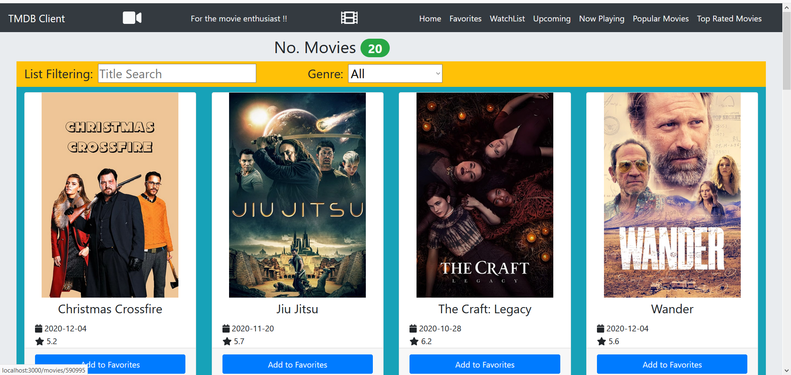
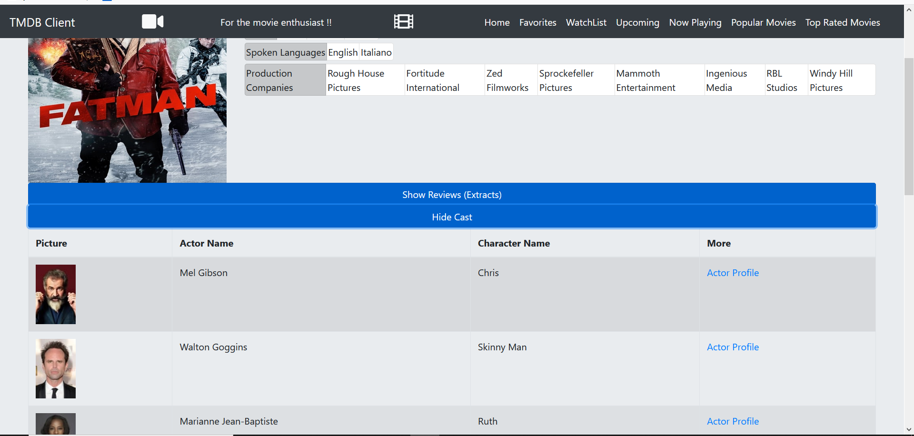
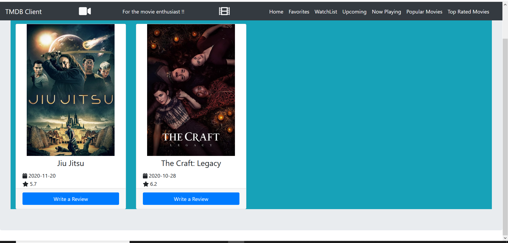
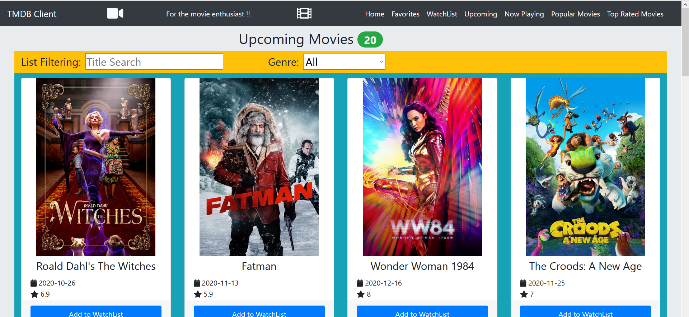
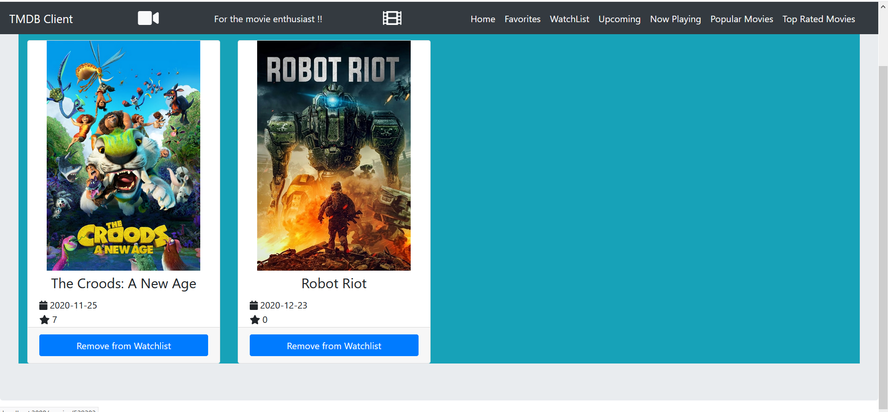
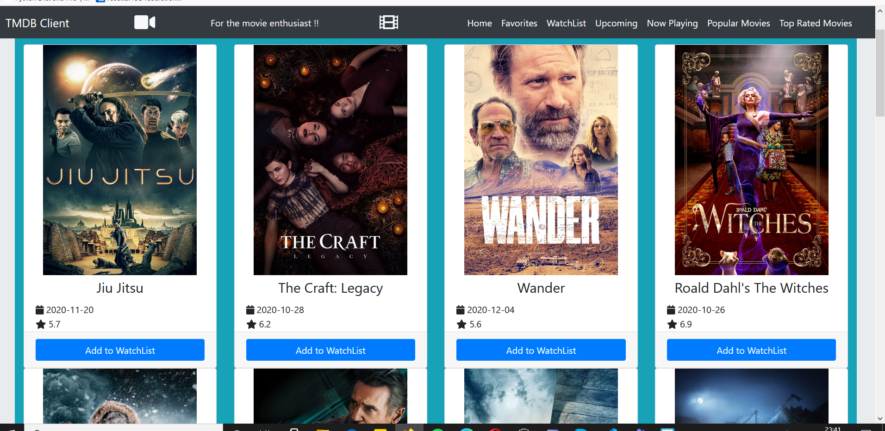
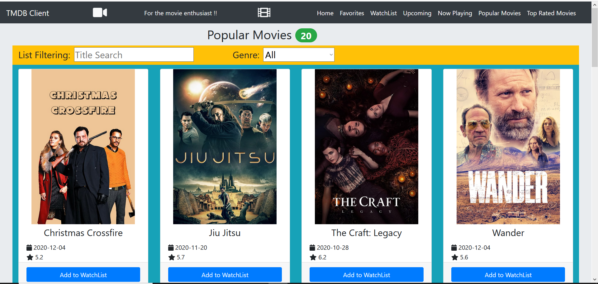
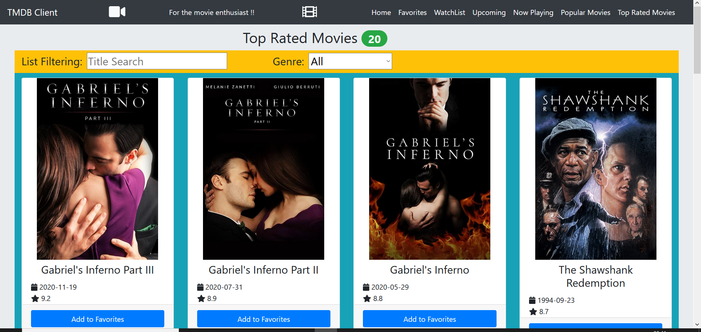
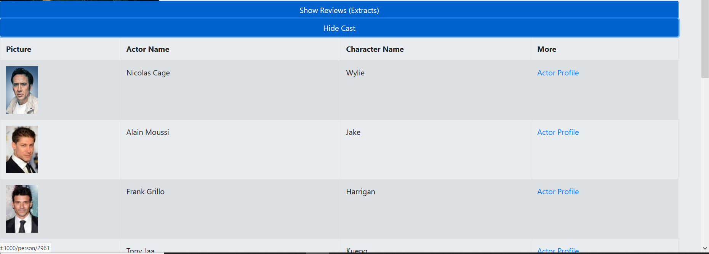

# Assignment 1 - ReactJS app.

Name: Cathal O'Brien

## Features.

...... A bullet-point list of the ADDITIONAL user features you have implemented for the  Movies Fan app ......,
 
 + Feature 1 - Watchlist - when the user selects 'add to watchlist' in the upcoming page, the movie will now be displayed in this page.
 + Feature 2 - Now Playing page - if the user is curious as to which movies are currently playing around them, they may click on this page via the link at the top of the paage to see a list of these movies.
 + Feature 3 = Popular Page - If a user would like to be inspired for current movies that are popular, they can go to the popular movies tab and look for inspiration there.
 + Feature 4 - Top Rated Page - If a user wishes to see what movies have been given th beat rating to see what may be a good watch, they can go to Top Rated via toip of the page link and view the top 20.
 + Show Cast - within any movie details, you can view the cast of the movie, a picture, character name, actor name and a hyperlink to their profile.
 + User can remove a movie from their watchlist

## Setup requirements (If required).

none other than standard

## API Data Model.

 - `https://api.themoviedb.org/3/movie/top_rated?api_key=${process.env.REACT_APP_TMDB_KEY}&language=en-US&page=1` - get the top rated movies in tmdb history
 
 - `https://api.themoviedb.org/3/movie/popular?api_key=${process.env.REACT_APP_TMDB_KEY}&language=en-US&page=1` - get the most popular movies at the moment
 
 - `https://api.themoviedb.org/3/movie/${id}/credits?api_key=${process.env.REACT_APP_TMDB_KEY}&language=en-US` - get  the cast list (credits) of the movie

- `https://api.themoviedb.org/3/movie/now_playing?api_key=${process.env.REACT_APP_TMDB_KEY}&language=en-US&page=1` - get what movies are currently playing

- `https://api.themoviedb.org/3/movie/upcoming?api_key=${process.env.REACT_APP_TMDB_KEY}&language=en-US&page=1` - get futuree upcoming movies

- `https://api.themoviedb.org/3/movie/${id}/reviews?api_key=${process.env.REACT_APP_TMDB_KEY}` - retrieve the movie reviews
 
 
- "https://api.themoviedb.org/3/genre/movie/list?api_key="process.env.REACT_APP_TMDB_KEY +"&language=en-US" - get the movie genres
      
      
 - `https://api.themoviedb.org/3/movie/${id}?api_key=${process.env.REACT_APP_TMDB_KEY}` - get the movie's id 
  
  
- `https://api.themoviedb.org/3/discover/movie?api_key=${process.env.REACT_APP_TMDB_KEY}&language=en-US&include_adult=false&page=1` - get movies
 
 
## App Design.

### Component catalogue (If required).

....... Insert a screenshot from the Storybook UI, hi-light stories relating to new/modified components you developed - see example screenshot below] .......

![][stories]

### UI Design.

This is my homepage that I have used in my webapp. It shows a list of current films with the ability to add to favourites. If you click on the image you can view some of the details about the movie

This is the movie details page which appears when you click on the movie's image. You can see information on the movie. If you shlick to show reviews, if there are any available you will be able to view what others think of the movie

If the user selects one of the movies as one of their favourites, it will be displayed on this page. As you can see some of the movies from the homepage are now displayed here.

if the user would like to view the movies that are coming out soon, they can view them on this page. If they like the look of the movie, they may choose to add it to their watchlist so they can look at it at a later date.

As mentioned above, if the user wishes to add the movies to their watchlist, it will be displayed here so as that the user can come back to it at a later date. The movie can also be removed when they've seen it for example.

The movies that are currently playing will be displayed here and have the button option to add it to add to watchlist if they are missing it at the moment and wish to catch it in the future.

if the user would like to see what current movies are trending and appear as popular, they can go to this page and once again have the option of adding it to their watchlist.

if the user would like to see what movies have the highest ever ratings, they can go to this page and once again have the option of adding it to their favourites.

## Routing.

...... Insert a list of the additional routes supported by your Movies Fan app. If relevant, specify which of the routes require authentication, i.e. protected/private.

+ /movies/favorites (protected) - displays the user's favorite movies selection.
+ /reviews/:id (public) - displays the full text of a movie review.
+ /reviews/form (private) - displays the form to fill out for a review
+ /movies/:id/full-cast (public) - gets the actors within a set movie
+ /movies/upcoming (public) - gets the upcoming movies
+ /movies/nowPlaying (public) -gets the movies now playing 
+ /movies/watchlist (protected) - gets the users watchlist
+ /movies/popular (public) - gets the most popular movies
+ /movies/topRated (public) - gets the top rated films

### Data hyperlinking.

if the user would like to find out other movies that an actor as appeared in, they have access to these links on the right hand side which navigate to a new page to show the movies that they have appeared in. In order to access this page there is a dropdown on the details page.Clicking the 'Full Review' above it for a review extract will display the full text of the review

Clicking a card causes the display of that movie's details.

